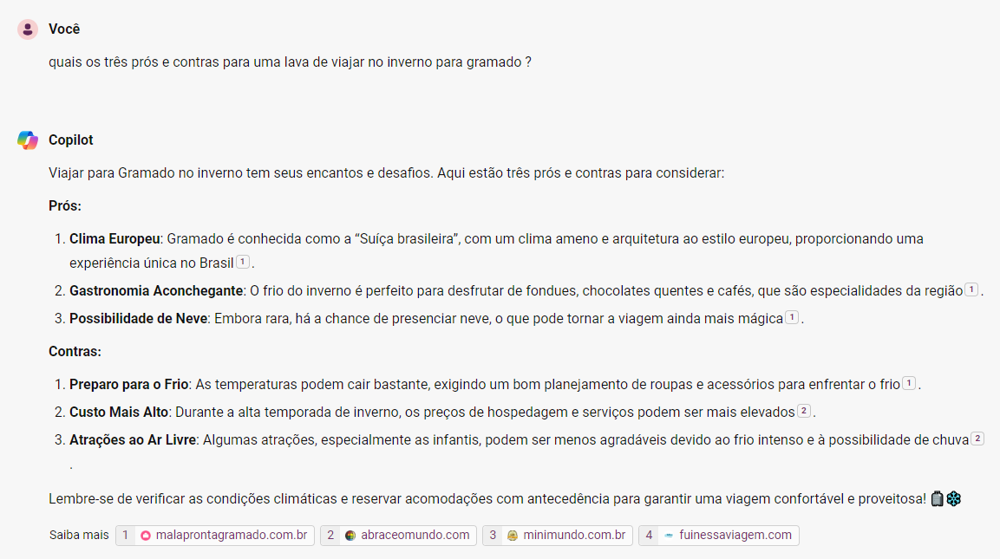

# 🤔 Quais os três prós e contras para uma lava de viajar no inverno para gramado?

Viajar para Gramado no inverno tem seus encantos e desafios. Aqui estão três prós e contras para considerar.

## ✅ Prós

- **Clima Europeu:** Gramado é conhecida como a “Suíça brasileira”, com um clima ameno e arquitetura ao estilo europeu, proporcionando uma experiência única no Brasil.
- **Gastronomia Aconchegante:** O frio do inverno é perfeito para desfrutar de fondues, chocolates quentes e cafés, que são especialidades da região.
- **Possibilidade de Neve:** Embora rara, há a chance de presenciar neve, o que pode tornar a viagem ainda mais mágica.

## ❌ Contras

- **Preparo para o Frio:** As temperaturas podem cair bastante, exigindo um bom planejamento de roupas e acessórios para enfrentar o frio.
- **Custo Mais Alto:** Durante a alta temporada de inverno, os preços de hospedagem e serviços podem ser mais elevados.
- **Atrações ao Ar Livre:** Algumas atrações, especialmente as infantis, podem ser menos agradáveis devido ao frio intenso e à possibilidade de chuva.

Lembre-se de verificar as condições climáticas e reservar acomodações com antecedência para garantir uma viagem confortável e proveitosa! 🧳❄️

---
 